# **Week 0 — Billing and Architecture**


## **Software Architecture Diagrams**

**C4 Model** C4 models are a set of software architecture models that provide a way to describe, document, and communicate the architecture of a software system. The C4 model was created by Simon Brown and is based on four levels of abstraction: context, containers, components, and code. The four levels of the C4 model are designed to provide different levels of detail and abstraction for different audiences.

Here's a brief overview of each level of the C4 model:

- Context: The context level provides a high-level view of the system and its environment. It shows the system in relation to other systems, users, and external factors.

- Containers: The container level shows the high-level components of the system and how they interact with each other. It provides a way to group related components and show how they are connected.

- Components: The component level shows the individual components that make up the containers. It provides a way to show the internal structure of the system and how the components interact with each other.

- Code: The code level shows the implementation details of the components. It provides a way to show how the components are implemented and how they are connected to each other.

### **Conceptual Architecture**

A conceptual architecture diagram is a high-level visual representation of the structure and components of a system or application. It typically shows the major components, their relationships, and how they interact with each other. Conceptual architecture diagrams are often used to communicate the overall structure of a system to stakeholders and other interested parties. A conceptual architecture diagram can help stakeholders understand the overall structure of a system and the relationships between its components. It can also serve as a starting point for more detailed design and planning activities.

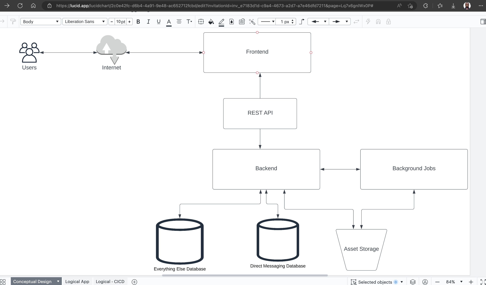

### **Logical Architecture**

A logical architecture diagram is a visual representation of the logical components, data flows, and interactions of a system or application. It focuses on the functional components of the system rather than the physical components. A logical architecture diagram is used to describe the structure and behavior of a system or application and is typically created during the early stages of system design.

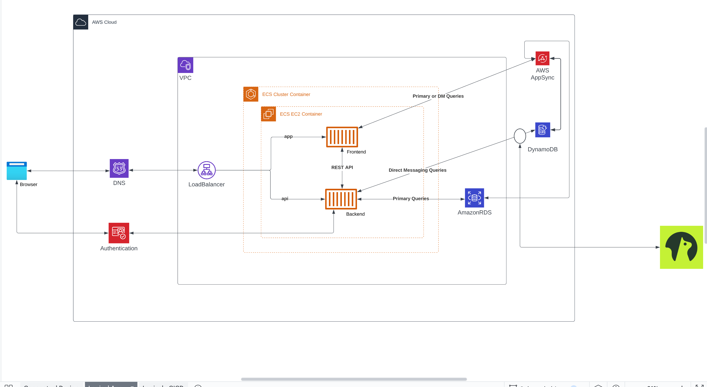

The link to the architecture diagram on LucidChart is [LucidChart Link](https://lucid.app/lucidchart/2c0e42fc-d6b4-4a91-9e48-ac652712fcbd/edit?viewport_loc=486%2C-194%2C1424%2C833%2Cd19xGk5ETTT.&invitationId=inv_e7183d1d-c9a4-4673-a2d7-a7e46dfd7211)


## **Homework Challenges**

### **Challenge 1: Set up AWS CLI on GitPod workspace**

I was able to set up AWS CLI on my GitPod workspace. I followed the instructions on the [AWS CLI Documentation](https://docs.aws.amazon.com/cli/latest/userguide/install-cliv2-linux.html#cliv2-linux-install) and was able to install the AWS CLI on my workspace by setting it up as a task to the gitpod.yml file and also did try to set it up on my local. I was able to run the `aws --version` command and got the following output: 

```bash
curl "https://awscli.amazonaws.com/awscli-exe-linux-x86_64.zip" -o "awscliv2.zip"
unzip awscliv2.zip
sudo ./aws/install
```

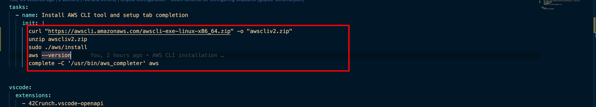

### **Challenge 2: Creating a billing alarm to monitor your estimated AWS charges**

Billing metric for AWS accounts are stored in US East 1 region (North Carolina) and this represents all usage across AWS regions. The allarm will be trigger when the current billing exceeds the threshold of $1.00. The alarm will be sent to my email address.

**Stesps for creating the billing alarm:**

- Enable billing alerts for your AWS account from Billing Prefereces page
- Create a Billing Alarm from CloudWatch console, create Alarm, select Billing metric, select the threshold, and under notification create an SNS topic and add your email address. configure the alarm to send the notification to your email address, accept the SNS topic request from your email.

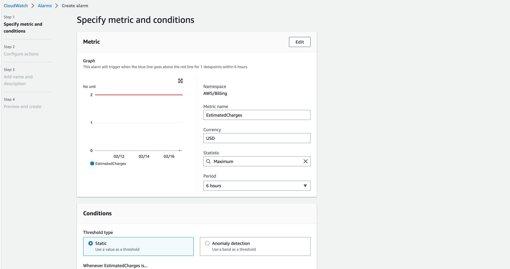

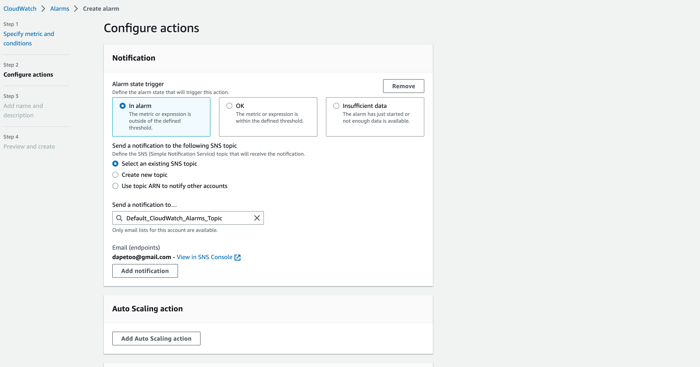

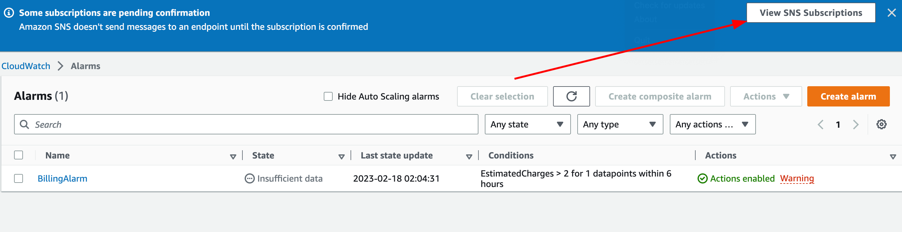

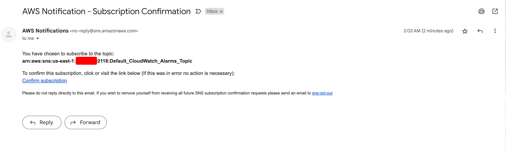

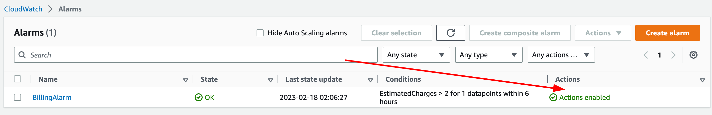


### **Challenge 3: Create a AWS  Budget**

**AWS Budgets** is a service that allows you to set custom cost and usage budgets for your AWS account. With AWS Budgets, you can create personalized budgets to track your AWS costs and usage in real-time, monitor and receive alerts when you exceed your budget, and take action to reduce your costs.

I created a budget for my AWS account. I set the budget to $1.00 and the budget will be sent to my email address. I also set the budget to send a notification when the budget is 75% of the threshold.

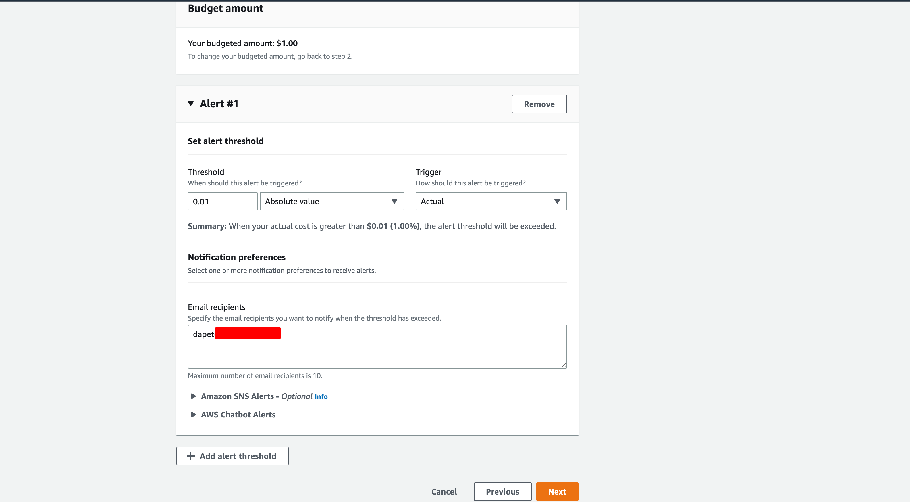

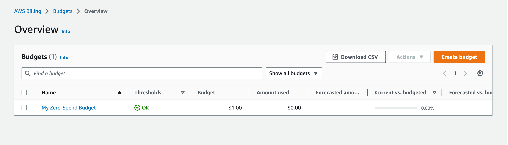

#### **Using AWS CLI to create a budget**

This budget.json file sets up a budget named "My Budget" with a limit of $10 USD per month. The budget is filtered by service in North Virginia Region. The budget type is COST and the time unit is MONTHLY, with a time period from January 1, 2023 to December 31, 2023. The budget also includes a notification that will be sent when the actual costs exceed 80% of the budget limit. The notification type is email, and the email addresses of the subscribers are listed in the SubscriberEmailAddresses field.

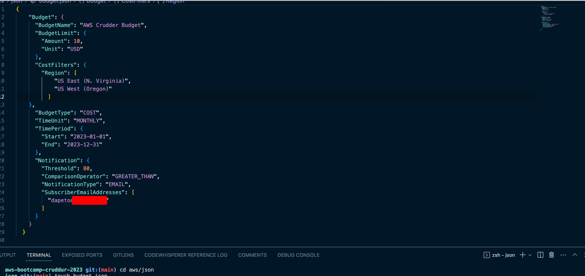

```bash
aws budgets create-budget --cli-input-json file://path/to/budget.json
```

### **Challenge 4: IAM User and IAM Role**

AWS IAM (Identity and Access Management) is a service for managing access to AWS resources. With IAM, you can create and manage AWS users and groups, and define permissions to access various AWS services and resources.

IAM is a critical component of AWS security and access control. It helps you to enforce the principle of **least privilege**, meaning that you *grant the minimum level of access necessary to perform a specific task*. By using IAM, you can also set up multi-factor authentication (MFA) for your users to increase the security of their access credentials. IAM supports a variety of authentication mechanisms, including AWS Management Console, AWS Command Line Interface (CLI), and programmatic access through APIs. You can also integrate IAM with other AWS services such as Amazon S3, Amazon EC2, and Amazon RDS, to control access to resources. Overall, IAM is an essential tool for managing access to AWS resources and maintaining the security of your AWS environment.

- **IAM User:** is an entity within AWS that you can create and manage to represent an individual or application that interacts with AWS resources. An IAM user has a unique name and a set of security credentials, including a password or access keys, that can be used to authenticate and authorize API requests to AWS services. IAM users can be assigned permissions and policies that define what actions they can perform on AWS resources, and they can be organized into groups for easier management and permission assignment. *IAM user is a way to grant authenticated access to AWS resources by providing a unique set of security credentials and permissions to an individual or application.* Follow the steps below to create an IAM user.

Open the AWS Management Console, navigate to the IAM service, and select "Users" from the left-hand navigation menu.
Click the "Add user" button to create a new user.
Enter a user name for the new user.

Select the access type for the user. You can choose between programmatic access (which generates access keys for use with the AWS API), AWS Management Console access (which allows the user to log in to the AWS Management Console), or both.

Set the permissions for the user. You can either attach existing policies to the user or create custom policies that define the specific permissions the user needs.

Review the configuration, and then click "Create user" to create the user.


- **IAM Role** is an AWS identity that you can create and manage to enable access to AWS resources. ***Unlike an IAM user, which is associated with a specific person or application and has permanent security credentials, an IAM role is intended to be assumed by another AWS identity, such as an IAM user, an EC2 instance, or an AWS service.*** IAM role is a way to grant temporary access to AWS resources to another AWS identity, such as an IAM user, an EC2 instance, or an AWS service, while also limiting the amount of access that entity has to the resources.

- **IAM Policy** is a document that defines permissions for an AWS identity, such as an IAM user or an IAM role, to access AWS resources. An IAM policy is a JSON document that specifies which actions are allowed or denied on which resources, and under which conditions. IAM policies are attached to IAM users, IAM roles, and AWS resources, such as Amazon S3 buckets, to define the permissions for those entities. IAM policies can be either managed policies or inline policies. *Managed policies are standalone policies that can be created, edited, and attached to multiple users or roles. Managed policies are useful for defining a set of permissions that can be shared across multiple users or roles.* *Inline policies, on the other hand, are policies that are embedded directly into a user or role. Inline policies are useful for defining permissions that are unique to a specific user or role.*
  
- **IAM Group** is a collection of IAM users. IAM groups make it easier to manage permissions for multiple IAM users, as you can assign permissions to a group of users instead of having to assign permissions to each user individually. IAM groups can also be used to manage access to AWS resources, as you can assign IAM policies to a group of users instead of having to assign policies to each user individually.


### **AWS CloudTrail**

AWS CloudTrail is a service provided by Amazon Web Services (AWS) that enables governance, compliance, operational auditing, and risk auditing of AWS accounts. It records and stores AWS API calls and events, such as configuration changes, authentication attempts, and resource usage, made by users, services, and AWS accounts in a designated AWS region.

CloudTrail provides visibility into user activity and resource changes across an AWS account, allowing organizations to ensure compliance with internal policies and external regulations. It also helps to detect and investigate security incidents and unauthorized access to resources by providing an audit trail of events.

In addition to recording API events, CloudTrail can be used to deliver log files to Amazon S3 buckets or Amazon CloudWatch Logs for analysis and storage. It can also be integrated with AWS services like AWS Config and AWS Security Hub for automated security and compliance analysis.

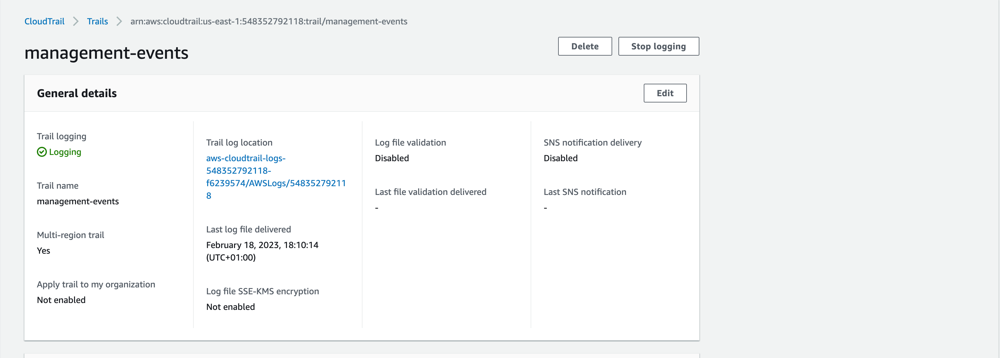