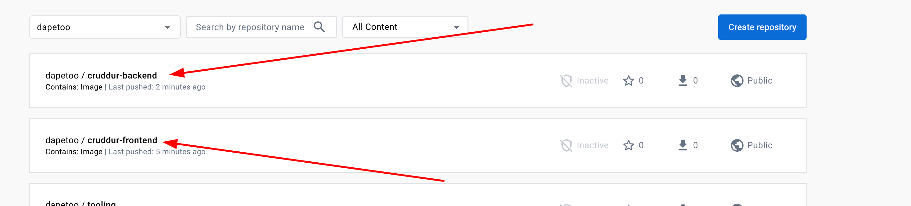
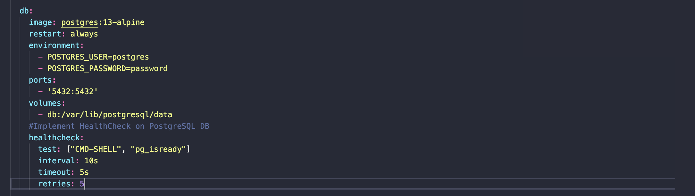
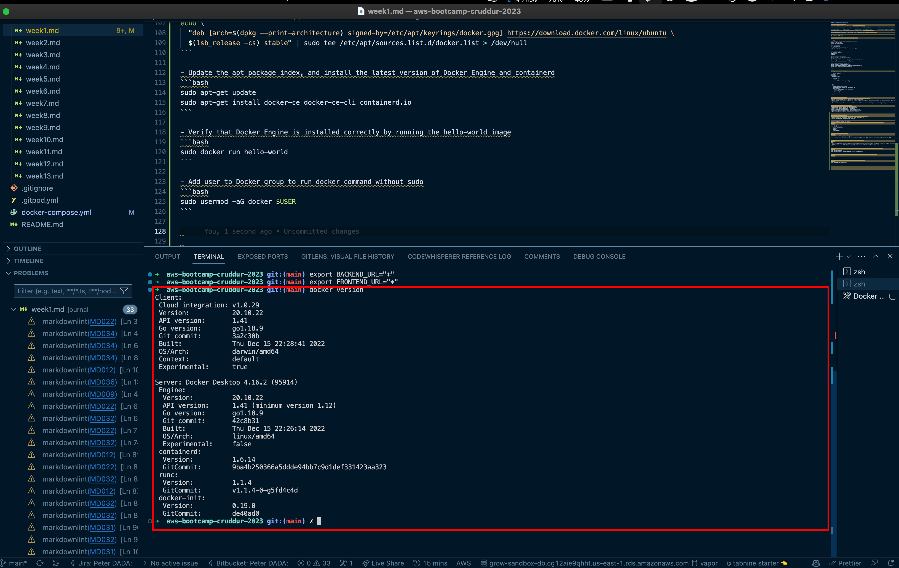

# Week 1 — App Containerization

This week I learnt about App containerization with Docker and Docker Compose. I also learnt about Dockerfile best practices and security best practices for Docker.

- Push and pull images to DockerHub and how to install Docker on Linux.
- Implement Health Checks in Docker Compose file for Postgres DB, Backend app to make sure they are in healthy and running state before starting the services that depends on them.
- Implement multi-build stage of Dockerfile to optimize and reduce image size
- Install Docker Desktop on Mac and Docker Engine on Ubuntu
- Run the project outside of CDE
- Scanned Docker images for vulnerabilities using snyk

## Homework Challenges

**Run the dockerfile CMD as an external script**

```bash
#Set Frontend and Backend environment variables
export FRONTEND_URL="*"
export BACKEND_URL="*"

#Run Backend App
```bash
!/bin/bash
cd backend-flask
pip install -r requirements.txt
python3 -m flask run --host=0.0.0.0 --port=4567

#Run Frontend App
```bash
!/bin/bash
cd frontend-react-js
npm install
npm run
```

## Build Frontend Dockerfile

Build, tag and push the frontend, backend docker image to DockerHub

```bash
cd frontend-react-js
# Build the image
docker build -t cruddur-frontend:v1 .
#Tag the image
docker tag cruddur-frontend:v1 dapetoo/cruddur-frontend:v1
# Push to DockerHub
docker push dapetoo/cruddur-frontend:v1

# Build the image
docker build -t cruddur-backend:v1 .
#Tag the image
docker tag cruddur-backend:v1 dapetoo/cruddur-backend:v1
# Push to DockerHub
docker push dapetoo/cruddur-backend:v1
```





### Implement Health Checks in Docker Compose file

Health Check is a way of checking the health of some resource. it is a command used to determine the health of a running container. When a health check command is specified, it tells Docker how to test the container to see if it's working.

```docker-compose
version: "3.8"
services:
  backend-flask:
  ...
    depends_on:
      db:
        condition: service_healthy
  ...
  ...
  
  db:
  ...   
    image: postgres:13-alpine
    #Implement HealthCheck on PostgreSQL DB
    healthcheck:
      test: ["CMD-SHELL", "pg_isready"]
      interval: 10s
      timeout: 5s
      retries: 5
  ...
```




### Implement multi-build stage of Dockerfile to optimize and reduce image size

```dockerfile
FROM node:16.18 as builder

ENV PORT=80
WORKDIR /frontend-react-js
COPY package.json /frontend-react-js
RUN npm install
COPY . /frontend-react-js/
RUN npm run build

#Production Environment
FROM nginx:1.23.3-alpine
COPY --from=builder /frontend-react-js/build /usr/share/nginx/html
EXPOSE ${PORT}
# CMD ["npm", "start"]
ENTRYPOINT [ "nginx", "-g", "daemon off;" ]
```

## Dockerfile Best Practices

- Exclude unnecessary files from the image by using .dockerignore file
- Using multi-stage builds to reduce the size of the image
- Don't install uneccessary packages not needed by the application, it can be installed for dev environment where there is a need to debug but not production enviroment.
- Decouple the applications, each ccontatiner should have one responsibility and not running multiple services in one container.

## Security Best Practices for Docker

- Use the right base image for the Dockerfile
- Always scan docker images for vulnerabilities
- Don't store sensitive data in a container
- Each container should have only one responsibility
- Use multi-stage build to create optimized Dockerfiles
- For critical applications, use a trusted registry


### Installing Docker on Linux

- Download Docker Desktop for Mac using the official download link
- Double click the downloaded docker.dmg file to install it
- Click on Launchpad to open Docker Desktop




### Installing Docker Engine on Ubuntu**

- Update the apt package index and install packages to allow apt to use a repository over HTTPS

```bash
sudo apt-get update
sudo apt-get install \
    ca-certificates \
    curl \
    gnupg \
    lsb-release
```

- Add Docker’s official GPG key

```bash
sudo mkdir -m 0755 -p /etc/apt/keyrings
curl -fsSL https://download.docker.com/linux/ubuntu/gpg | sudo gpg --dearmor -o /etc/apt/keyrings/docker.gpg
```

- Use the following command to set up the stable repository

```bash
echo \
  "deb [arch=$(dpkg --print-architecture) signed-by=/etc/apt/keyrings/docker.gpg] https://download.docker.com/linux/ubuntu \
  $(lsb_release -cs) stable" | sudo tee /etc/apt/sources.list.d/docker.list > /dev/null
```

- Update the apt package index, and install the latest version of Docker Engine and containerd

```bash
sudo apt-get update
sudo apt-get install docker-ce docker-ce-cli containerd.io
```

- Verify that Docker Engine is installed correctly by running the hello-world image

```bash
sudo docker run hello-world
```

- Add user to Docker group to run docker command without sudo

```bash
sudo usermod -aG docker $USER
sudo newgrp docker
```


