# Week 2 — Distributed Tracing

I learnt about Distributed Tracing, Application Monitoring and Logging with HoneyComb, Rollbar, AWS CloudWatch, AWS X-ray and OpenTelemetry. I also learnt about how to instrument a React application with OpenTelemetry and how to use Honeycomb to visualize the traces. I set up custom span attributes and custom span events to visualize the traces.

## OpenTelemetry
OpenTelemetry is a collection of tools, APIs, and SDKs. You can use it to instrument, generate, collect, and export telemetry data (metrics, logs, and traces) for analysis in order to understand your software's performance and behavior. OpenTelemetry is a collection of tools, APIs, and SDKs. You can use it to instrument, generate, collect, and export telemetry data (metrics, logs, and traces) for analysis in order to understand your software's performance and behavior.

## XRAY SDK
AWS XRAY SDK is a software development kit that allows you to add instrumentation to your application to collect request data for requests that your application serves. The SDK automatically intercepts incoming requests and outgoing HTTP calls to record the data. The data is then sent to the AWS X-Ray daemon, which is a background process that listens for requests on UDP port 2000. The daemon then sends the data to the AWS X-Ray service. The service processes and stores the data.

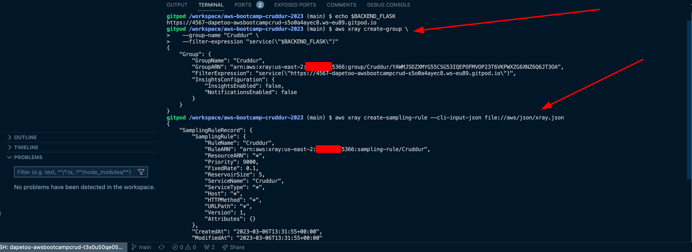

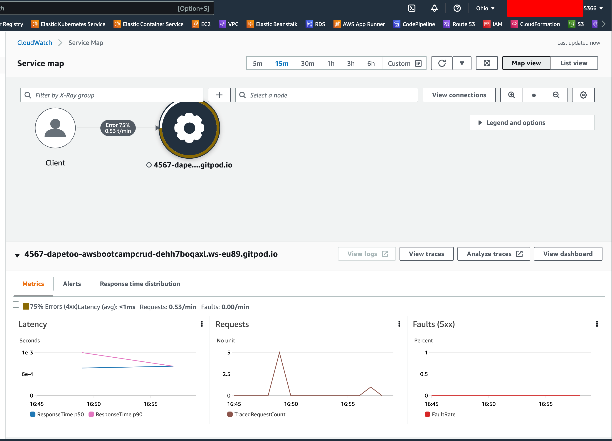

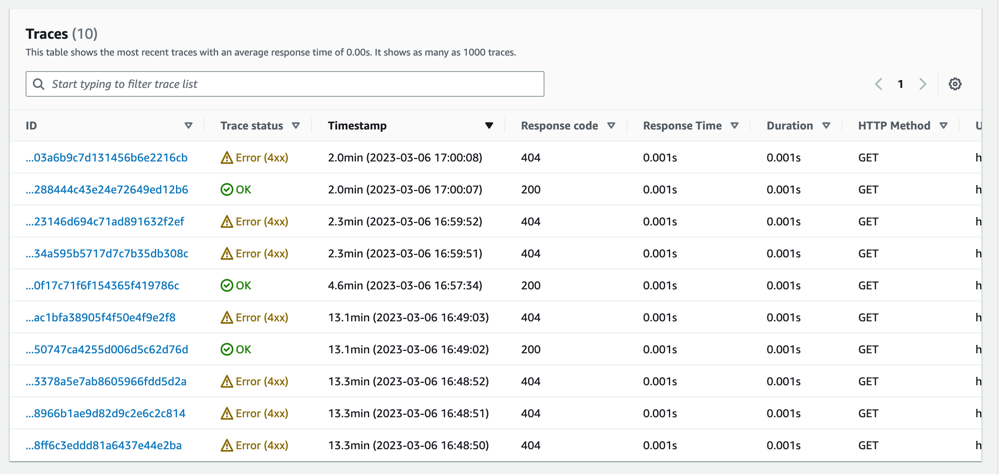

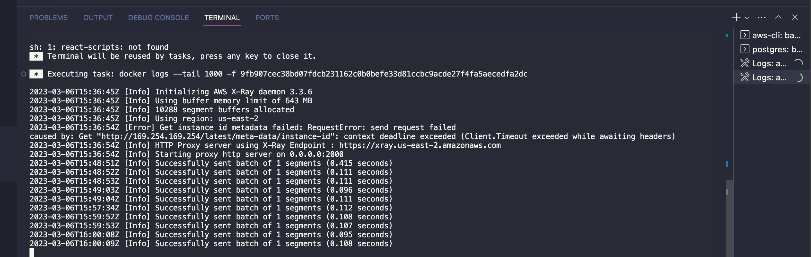

## Honeycomb
Honeycomb is a service that allows you to collect, query, and analyze events from your software systems. It is a powerful tool for debugging, troubleshooting, and optimizing your software. Honeycomb is a service that allows you to collect, query, and analyze events from your software systems. It is a powerful tool for debugging, troubleshooting, and optimizing your software.

**Browser instrumentation**

This refers to the process of collecting and analyzing data related to the behavior of web browsers. This data can be used to gain insights into how users interact with web applications, identify performance bottlenecks, and improve the overall user experience.

Open telemetry package for opentelemetry and browser instrumentation

```
    "@opentelemetry/api": "^1.4.0",
    "@opentelemetry/auto-instrumentations-web": "^0.31.2",
    "@opentelemetry/context-zone": "^1.9.1",
    "@opentelemetry/exporter-trace-otlp-http": "^0.35.1",
    "@opentelemetry/instrumentation": "^0.35.1",
    "@opentelemetry/instrumentation-document-load": "^0.31.2",
    "@opentelemetry/instrumentation-fetch": "^0.35.1",
    "@opentelemetry/instrumentation-http": "^0.35.1",
    "@opentelemetry/instrumentation-long-task": "^0.32.2",
    "@opentelemetry/instrumentation-user-interaction": "^0.32.1",
    "@opentelemetry/instrumentation-xml-http-request": "^0.35.1",
    "@opentelemetry/sdk-trace-web": "^1.9.1",
```

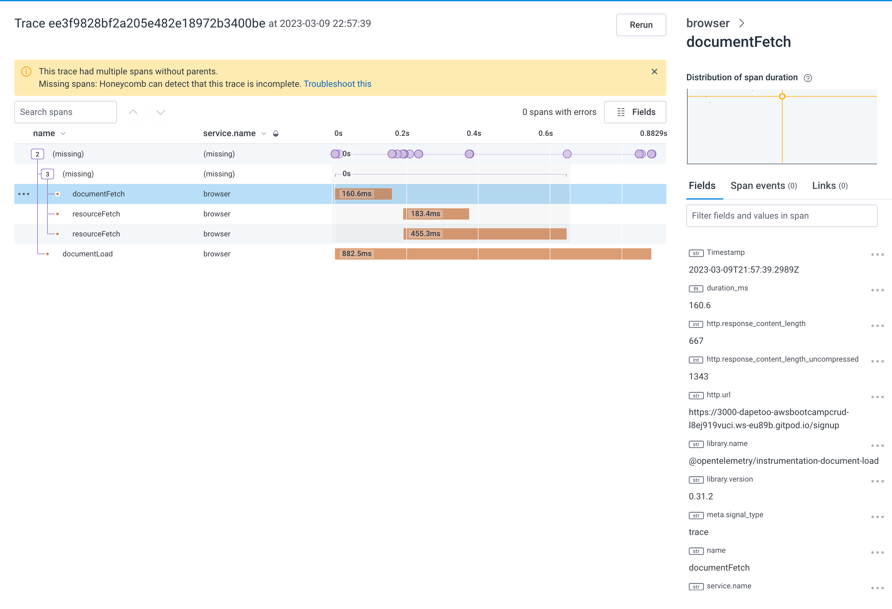

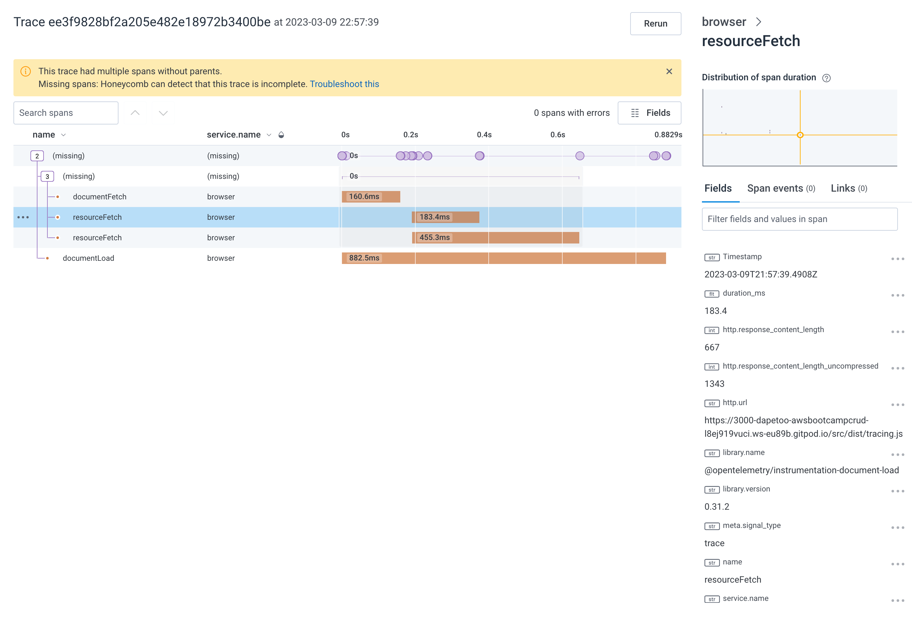

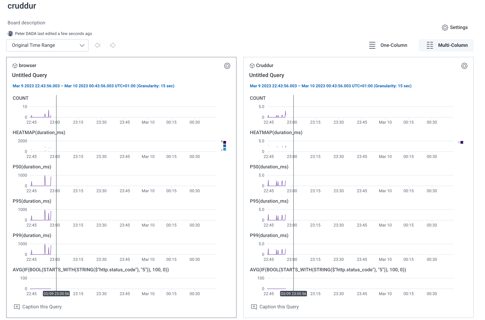

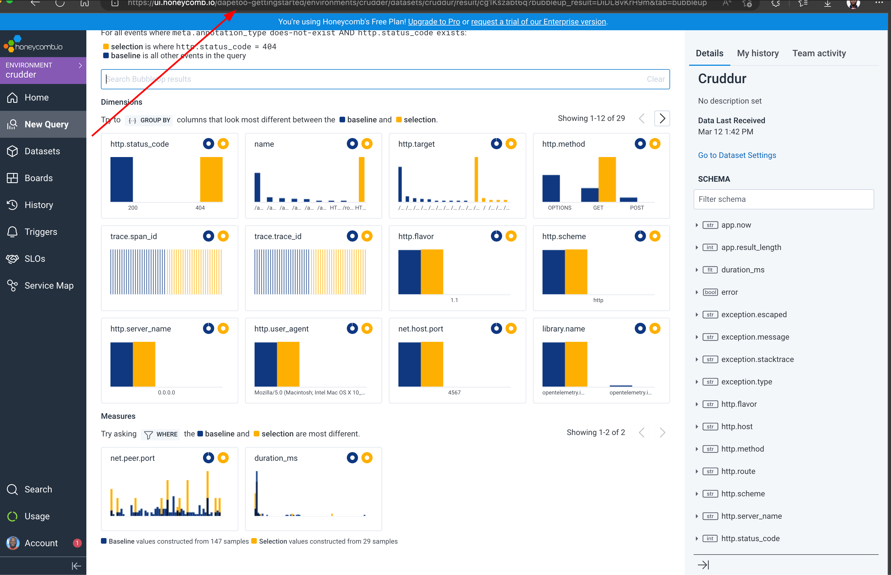

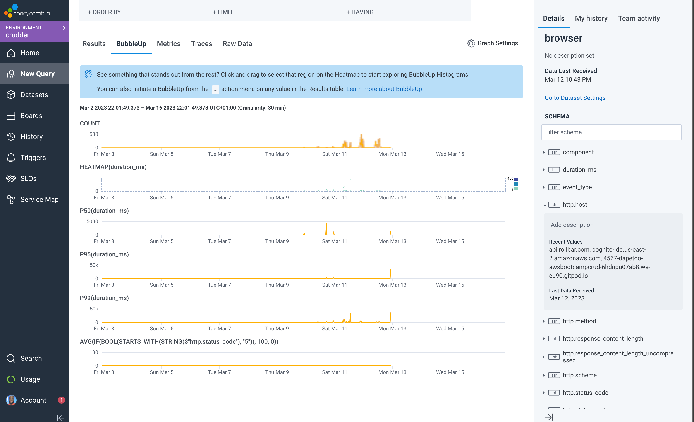

## CloudWatch
Amazon CloudWatch is a monitoring and observability service built for DevOps engineers, developers, site reliability engineers (SREs), and IT managers. CloudWatch provides you with data and actionable insights to monitor your applications, respond to system-wide performance changes, optimize resource utilization, and get a unified view of operational health.

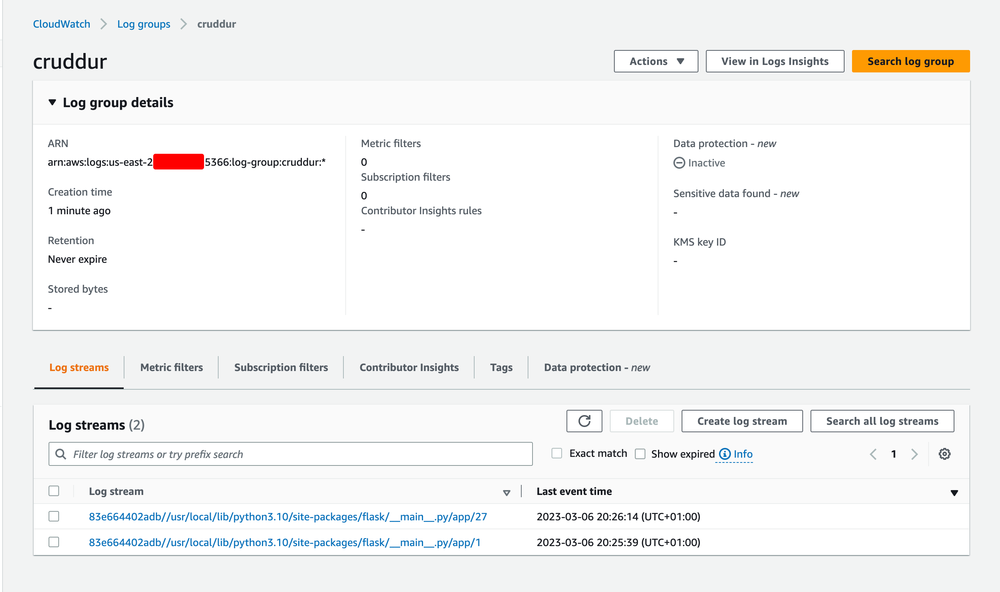


## Rollbar 
Rollbar is a service that collects and aggregates errors from your software in one place so you can prioritize and fix them. 

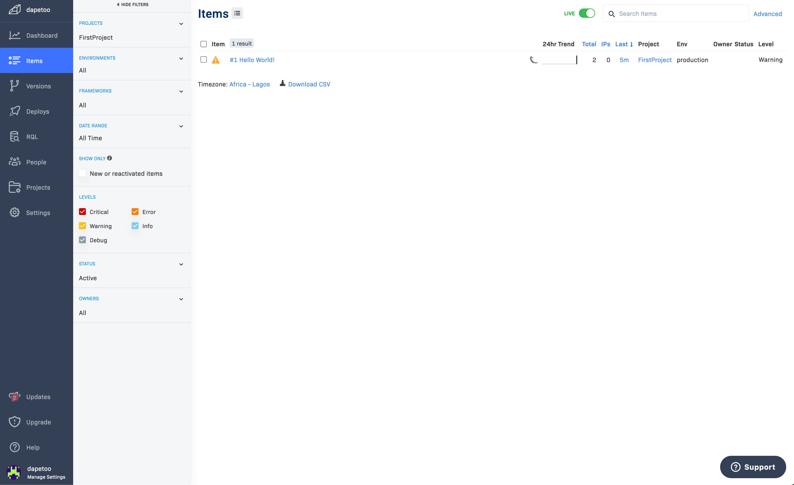


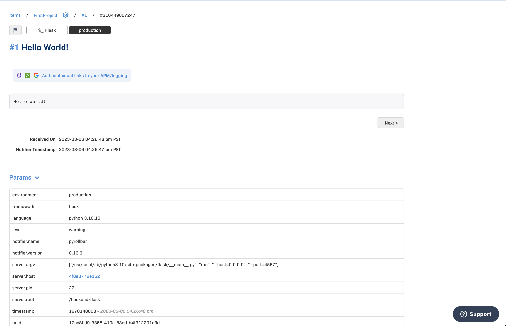