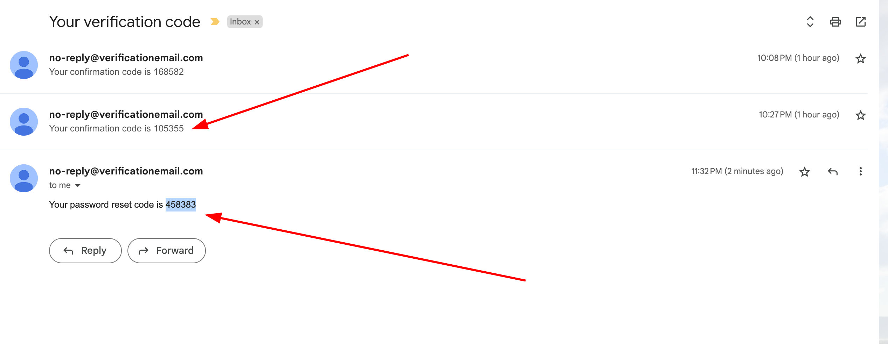
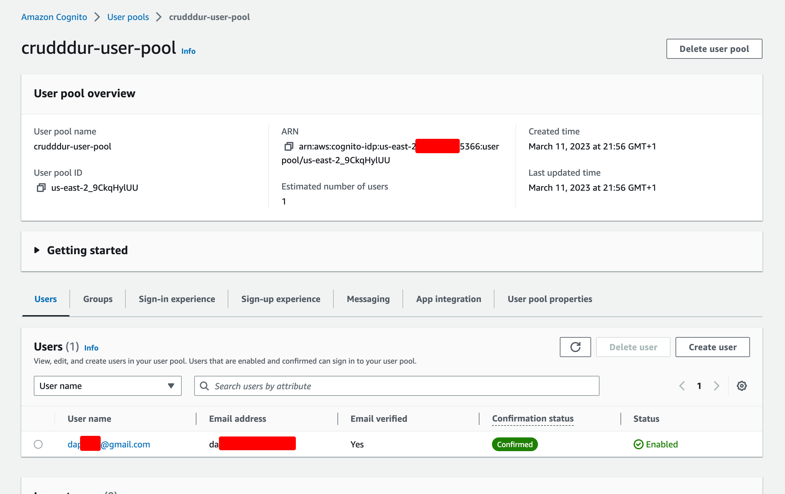
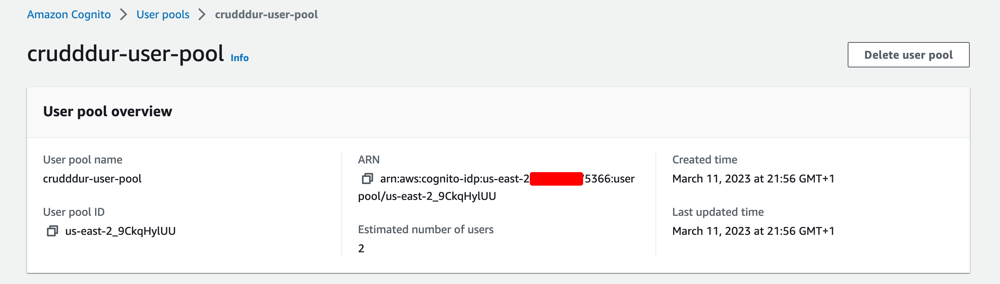
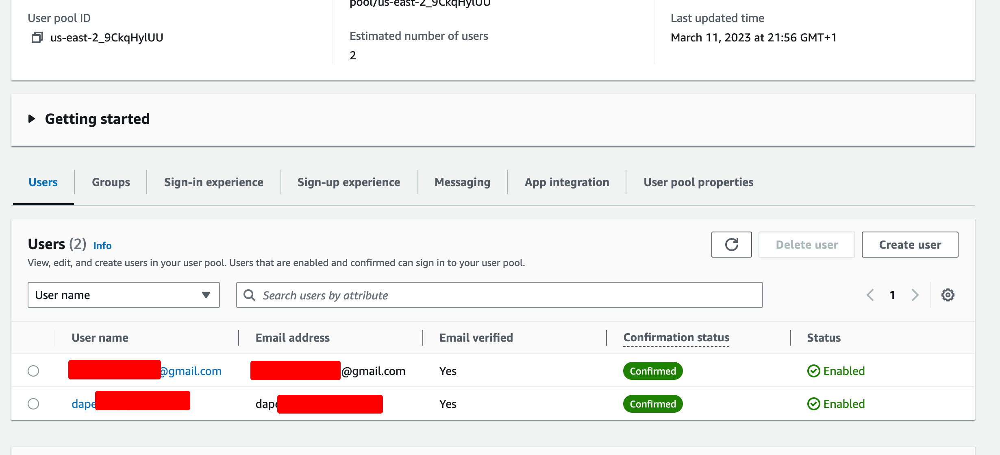
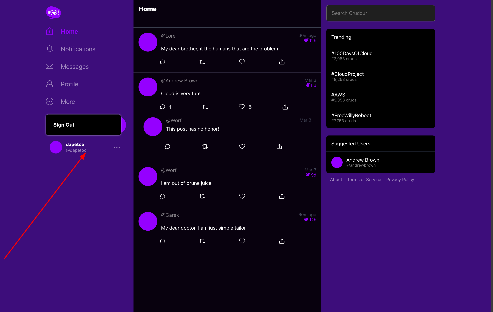
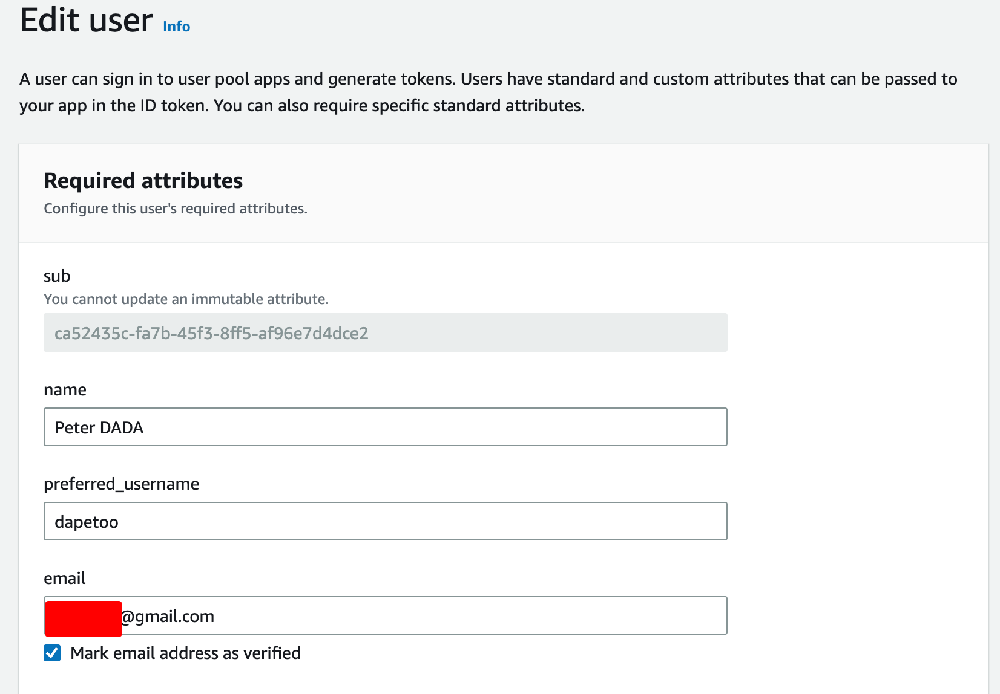
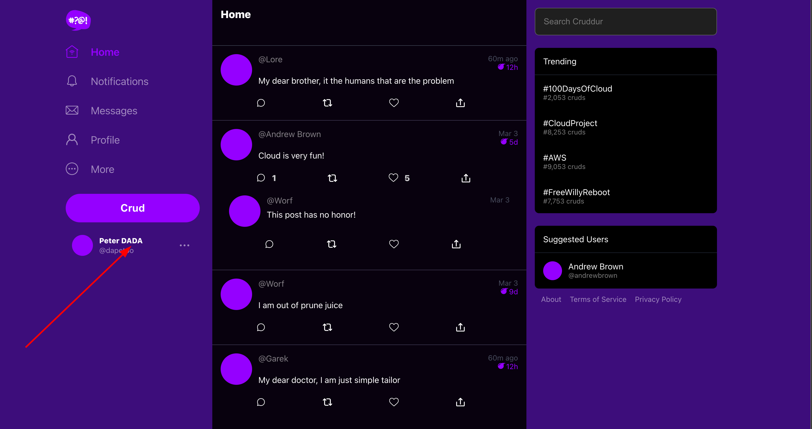
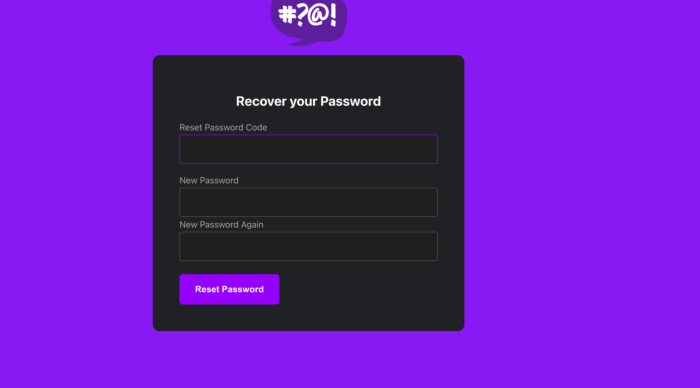
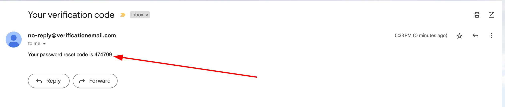
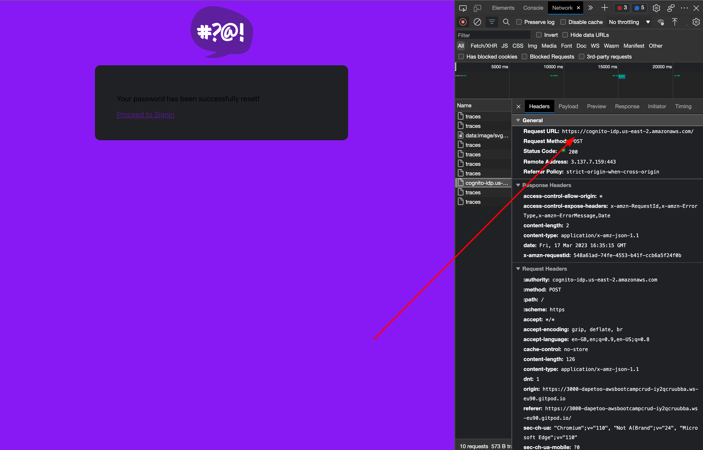

# Week 3 — Decentralized Authentication

Authentication is the process of determining if a user is who they say they are. Authentication is needed where a user must be verified in order to access a secure resource on a system. Form-based authentication is where a user is presented with a form allowing them to enter username and password credentials.

Decentralized authentication simply means that there is no central authority needed to verify your identity, i.e., decentralized identifiers. DIDs (Decentralized Identifiers) are a special type of identifier that allows for decentralized, verified digital identification. A DID is any subject identified by the DID's controller (e.g., a person, organization, thing, data model, abstract entity, etc.). DIDs are a new type of identifier that enables verifiable, decentralized digital identity.

## Amazon Cognito

Amazon Cognito lets you easily add user sign-up and authentication to your mobile and web apps. Amazon Cognito also enables you to authenticate users through an external identity provider and provides temporary security credentials to access your app's backend resources in AWS or any service behind Amazon API Gateway.

**A user pool** is a user directory in Amazon Cognito. With a user pool, your users can sign in to your web or mobile app through Amazon Cognito. Your users can also sign in through social identity providers like Google, Facebook, Amazon, or Apple, and through SAML identity providers. Whether your users sign in directly or through a third party, all members of the user pool have a directory profile that you can access through a Software Development Kit (SDK). User pools provide:

- Sign-up and sign-in services.

- A built-in, customizable web UI to sign in users.

- Social sign-in with Facebook, Google, Login with Amazon, and Sign in with Apple, as well as sign-in with SAML identity providers from your user pool.

- User directory management and user profiles.

- Security features such as multi-factor authentication (MFA), checks for compromised credentials, account takeover protection, and phone and email verification.

- Customized workflows and user migration through AWS Lambda triggers.

- Integration with Amazon Simple Notification Service (Amazon SNS) to send SMS messages to users.

Project Screeenshot

